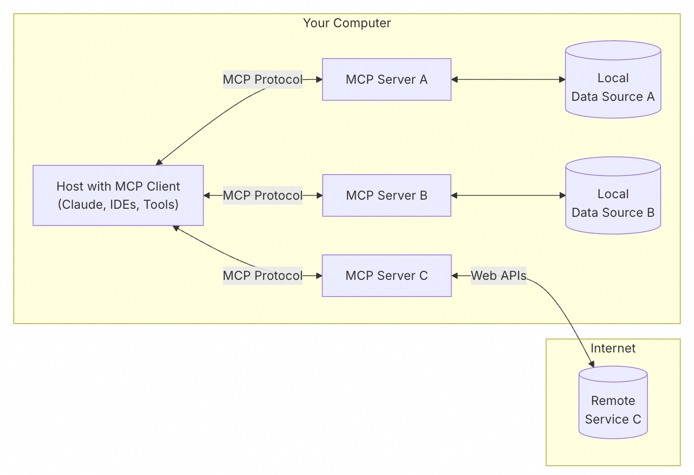
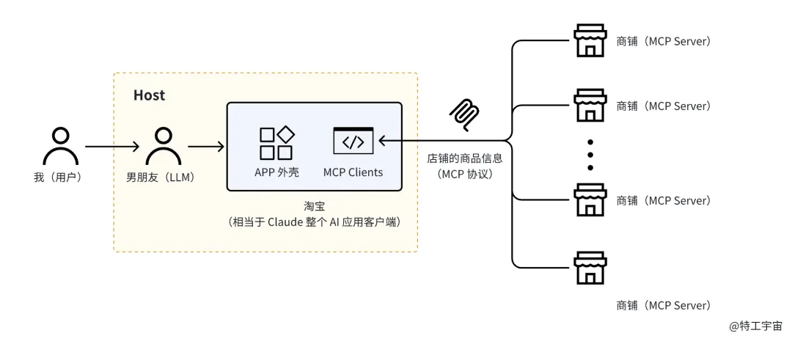
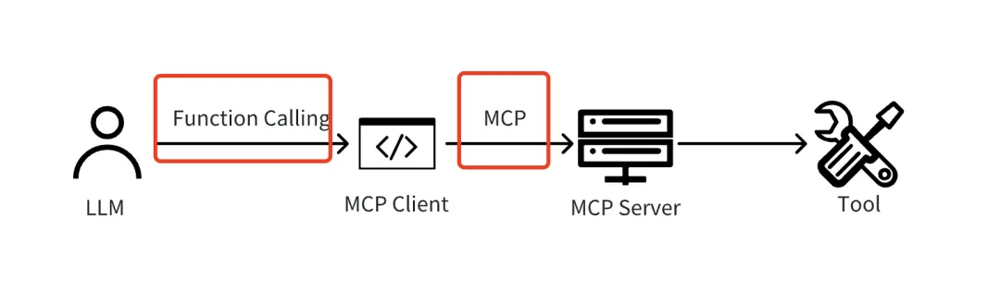
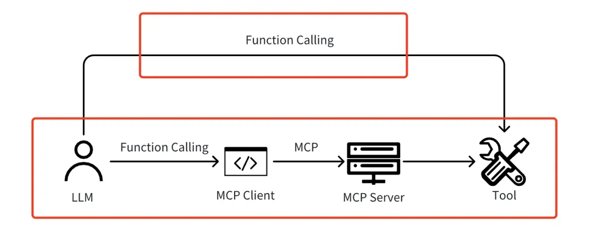

> 官方地址：https://modelcontextprotocol.io/introduction
>
> 参考链接：https://mp.weixin.qq.com/s/GrEWFqpmvp1LfURAT1XzZw

# 概念

MCP全称Model Context Protocol，模型上下文协议，由OpenAI前团队成立的Anthropic制定并开源。

MCP定义了LLM调用第三方AI产品/工具的协议标准，避免厂商各玩各的协议，增加AI接入复杂性，此外基于此开源协议，可以实现AI应用生态市场。就像USBC标准一样。下图是MCP的架构图

- MCP Server：各家AI产品/工具厂商，只管提供各种工具。例如高德、淘宝。当前支持3种类型，分别为：

- 工具（Tools）：可以被 LLM 调用的函数（需要用户批准）。（用的最多的）
- 资源（Resources）：类似文件的数据，可以被客户端读取，如 文件内容。
- 提示（Prompts）：预先编写的模板，帮助用户完成特定任务。

- MCP Client：与MCP Server 1对1，通过MCP Protocol交互的客户端
- MCP Host：通过 MCP Client 获取并使用这些工具

MCP 协议支持两种主要的通信机制：基于stdio和基于SSE（Server-Sent Events）的远程通信。这两种机制都使用 JSON-RPC 2.0 格式进行消息传输。

具体一点，用户通过LLM平台，请求执行一系列操作。例如“查找未来3天天气好的日期，帮我制定下出游行程”。该过程需要通过天气应用、航班应用、出游应用组合实现。LLM通过MCP Client，分别调用上述3个应用的MCP Server。

每个应用只需要按照协议标准，实现MCP Server和MCP Client就可以在支持MCP的LLM上接入，实现组合效果。

# 问题

## MCP和Function Calling的关系

Function Calling是什么

直接Copy链接的内容

为什么有人说它俩毫无关系，又有人说 MCP 是 Function Calling 封装了一层？到底谁是对的？

其实这两种说法都是对的，只是不同视角的解读。

**为什么说 MCP 和 Function Calling 毫无关系呢？**

从利用 MCP 进行工具调用流程来看，这里的 MCP 更多指的是协议本身（Client 和 Server 的连接），MCP 协议只关心商品在电商平台的上架情况，而 Function Calling 是模型调用工具的主流手段之一（纯靠系统提示词也可以），即男朋友怎么买怎么用这些商品，MCP 协议并不在乎这些，这是一条链路上的两个部分，所以没什么关系。

**那为什么说 MCP 是 Function Calling 的封装呢？**

这里的 MCP 更多指的是整个让模型调用工具的整体手段（即下图中下面这个红框）。无论是原先的 Function Calling（上红框），还是现在的 MCP，本质都是让男朋友买到商品并使用（让模型调用工具），因此核心目的相同。而至于为何认为是封装，是因为在当前 MCP 整体实现路径中，Host 里的 LLM 向 Client 调用工具时，大多仍然使用 Function Calling，所以可以理解成 MCP 封装了 Function Calling。

