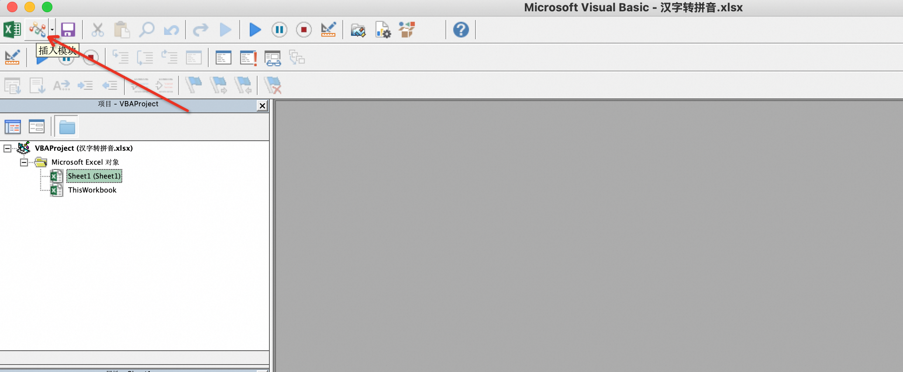
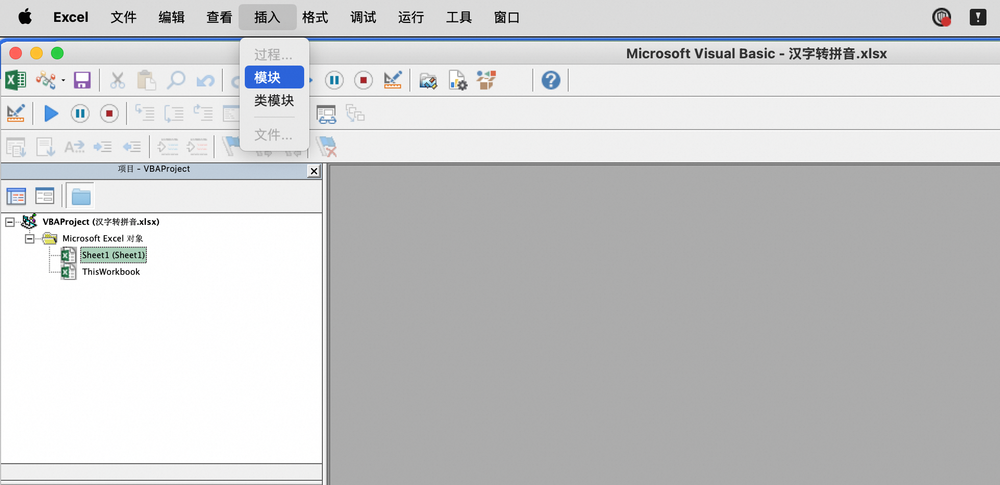
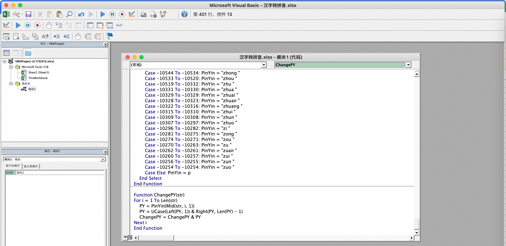
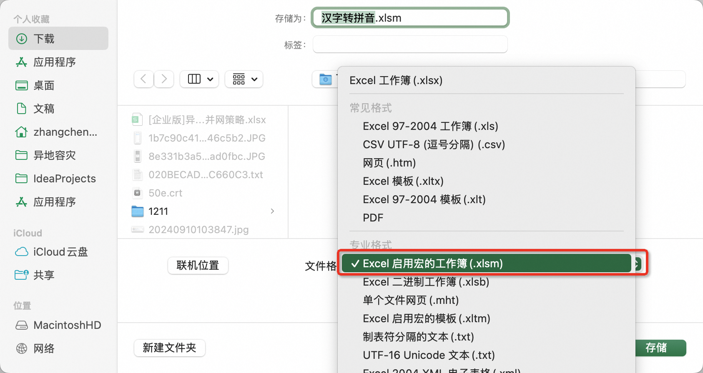
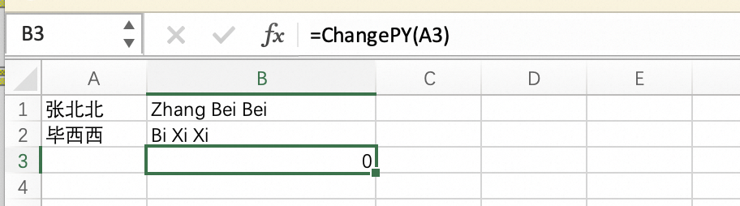

### 操作方法

#### 1. 打开Excel，然后按Alt键+F11键打开Viaual Basic编辑器，点击工具栏插入，下拉菜单点击模块。



或者




#### 2. 将转换函数，复制到模块输入框中

```vbnet
Function PinYin(p As String) As String
    i = Asc(p)
    Select Case i
    Case -20319 To -20318: PinYin = "a "
    Case -20317 To -20305: PinYin = "ai "
    Case -20304 To -20296: PinYin = "an "
    Case -20295 To -20293: PinYin = "ang "
    Case -20292 To -20284: PinYin = "ao "
    Case -20283 To -20266: PinYin = "ba "
    Case -20265 To -20258: PinYin = "bai "
    Case -20257 To -20243: PinYin = "ban "
    Case -20242 To -20231: PinYin = "bang "
    Case -20230 To -20052: PinYin = "bao "
    Case -20051 To -20037: PinYin = "bei "
    Case -20036 To -20033: PinYin = "ben "
    Case -20032 To -20027: PinYin = "beng "
    Case -20026 To -20003: PinYin = "bi "
    Case -20002 To -19991: PinYin = "bian "
    Case -19990 To -19987: PinYin = "biao "
    Case -19986 To -19983: PinYin = "bie "
    Case -19982 To -19977: PinYin = "bin "
    Case -19976 To -19806: PinYin = "bing "
    Case -19805 To -19785: PinYin = "bo "
    Case -19784 To -19776: PinYin = "bu "
    Case -19775 To -19775: PinYin = "ca "
    Case -19774 To -19764: PinYin = "cai "
    Case -19763 To -19757: PinYin = "can "
    Case -19756 To -19752: PinYin = "cang "
    Case -19751 To -19747: PinYin = "cao "
    Case -19746 To -19742: PinYin = "ce "
    Case -19741 To -19740: PinYin = "ceng "
    Case -19739 To -19729: PinYin = "cha "
    Case -19728 To -19726: PinYin = "chai "
    Case -19725 To -19716: PinYin = "chan "
    Case -19715 To -19541: PinYin = "chang "
    Case -19540 To -19532: PinYin = "chao "
    Case -19531 To -19526: PinYin = "che "
    Case -19525 To -19516: PinYin = "chen "
    Case -19515 To -19501: PinYin = "cheng "
    Case -19500 To -19485: PinYin = "chi "
    Case -19484 To -19480: PinYin = "chong "
    Case -19479 To -19468: PinYin = "chou "
    Case -19467 To -19290: PinYin = "chu "
    Case -19289 To -19289: PinYin = "chuai "
    Case -19288 To -19282: PinYin = "chuan "
    Case -19281 To -19276: PinYin = "chuang "
    Case -19275 To -19271: PinYin = "chui "
    Case -19270 To -19264: PinYin = "chun "
    Case -19263 To -19262: PinYin = "chuo "
    Case -19261 To -19250: PinYin = "ci "
    Case -19249 To -19244: PinYin = "cong "
    Case -19243 To -19243: PinYin = "cou "
    Case -19242 To -19239: PinYin = "cu "
    Case -19238 To -19236: PinYin = "cuan "
    Case -19235 To -19228: PinYin = "cui "
    Case -19227 To -19225: PinYin = "cun "
    Case -19224 To -19219: PinYin = "cuo "
    Case -19218 To -19213: PinYin = "da "
    Case -19212 To -19039: PinYin = "dai "
    Case -19038 To -19024: PinYin = "dan "
    Case -19023 To -19019: PinYin = "dang "
    Case -19018 To -19007: PinYin = "dao "
    Case -19006 To -19004: PinYin = "de "
    Case -19003 To -18997: PinYin = "deng "
    Case -18996 To -18978: PinYin = "di "
    Case -18977 To -18962: PinYin = "dian "
    Case -18961 To -18953: PinYin = "diao "
    Case -18952 To -18784: PinYin = "die "
    Case -18783 To -18775: PinYin = "ding "
    Case -18774 To -18774: PinYin = "diu "
    Case -18773 To -18527: PinYin = "dong "
    Case -18526 To -18519: PinYin = "fa "
    Case -18518 To -18502: PinYin = "fan "
    Case -18501 To -18491: PinYin = "fang "
    Case -18490 To -18479: PinYin = "fei "
    Case -18478 To -18464: PinYin = "fen "
    Case -18463 To -18449: PinYin = "feng "
    Case -18448 To -18448: PinYin = "fo "
    Case -18447 To -18447: PinYin = "fou "
    Case -18446 To -18240: PinYin = "fu "
    Case -18239 To -18238: PinYin = "ga "
    Case -18237 To -18232: PinYin = "gai "
    Case -18231 To -18221: PinYin = "gan "
    Case -18220 To -18212: PinYin = "gang "
    Case -18211 To -18202: PinYin = "gao "
    Case -18201 To -18185: PinYin = "ge "
    Case -18184 To -18184: PinYin = "gei "
    Case -18183 To -18182: PinYin = "gen "
    Case -18181 To -18013: PinYin = "geng "
    Case -18012 To -17998: PinYin = "gong "
    Case -17997 To -17989: PinYin = "gou "
    Case -17988 To -17971: PinYin = "gu "
    Case -17970 To -17965: PinYin = "gua "
    Case -17964 To -17962: PinYin = "guai "
    Case -17961 To -17951: PinYin = "guan "
    Case -17950 To -17948: PinYin = "guang "
    Case -17947 To -17932: PinYin = "gui "
    Case -17931 To -17929: PinYin = "gun "
    Case -17928 To -17923: PinYin = "guo "
    Case -17922 To -17760: PinYin = "ha "
    Case -17759 To -17753: PinYin = "hai "
    Case -17752 To -17734: PinYin = "han "
    Case -17733 To -17731: PinYin = "hang "
    Case -17730 To -17722: PinYin = "hao "
    Case -17721 To -17704: PinYin = "he "
    Case -17703 To -17702: PinYin = "hei "
    Case -17701 To -17698: PinYin = "hen "
    Case -17697 To -17693: PinYin = "heng "
    Case -17692 To -17684: PinYin = "hong "
    Case -17683 To -17677: PinYin = "hou "
    Case -17676 To -17497: PinYin = "hu "
    Case -17496 To -17488: PinYin = "hua "
    Case -17487 To -17483: PinYin = "huai "
    Case -17482 To -17469: PinYin = "huan "
    Case -17468 To -17455: PinYin = "huang "
    Case -17454 To -17434: PinYin = "hui "
    Case -17433 To -17428: PinYin = "hun "
    Case -17427 To -17418: PinYin = "huo "
    Case -17417 To -17203: PinYin = "ji "
    Case -17202 To -17186: PinYin = "jia "
    Case -17185 To -16984: PinYin = "jian "
    Case -16983 To -16971: PinYin = "jiang "
    Case -16970 To -16943: PinYin = "jiao "
    Case -16942 To -16916: PinYin = "jie "
    Case -16915 To -16734: PinYin = "jin "
    Case -16733 To -16709: PinYin = "jing "
    Case -16708 To -16707: PinYin = "jiong "
    Case -16706 To -16690: PinYin = "jiu "
    Case -16689 To -16665: PinYin = "ju "
    Case -16664 To -16658: PinYin = "juan "
    Case -16657 To -16648: PinYin = "jue "
    Case -16647 To -16475: PinYin = "jun "
    Case -16474 To -16471: PinYin = "ka "
    Case -16470 To -16466: PinYin = "kai "
    Case -16465 To -16460: PinYin = "kan "
    Case -16459 To -16453: PinYin = "kang "
    Case -16452 To -16449: PinYin = "kao "
    Case -16448 To -16434: PinYin = "ke "
    Case -16433 To -16430: PinYin = "ken "
    Case -16429 To -16428: PinYin = "keng "
    Case -16427 To -16424: PinYin = "kong "
    Case -16423 To -16420: PinYin = "kou "
    Case -16419 To -16413: PinYin = "ku "
    Case -16412 To -16408: PinYin = "kua "
    Case -16407 To -16404: PinYin = "kuai "
    Case -16403 To -16402: PinYin = "kuan "
    Case -16401 To -16394: PinYin = "kuang "
    Case -16393 To -16221: PinYin = "kui "
    Case -16220 To -16217: PinYin = "kun "
    Case -16216 To -16213: PinYin = "kuo "
    Case -16212 To -16206: PinYin = "la "
    Case -16205 To -16203: PinYin = "lai "
    Case -16202 To -16188: PinYin = "lan "
    Case -16187 To -16181: PinYin = "lang "
    Case -16180 To -16172: PinYin = "lao "
    Case -16171 To -16170: PinYin = "le "
    Case -16169 To -16159: PinYin = "lei "
    Case -16158 To -16156: PinYin = "leng "
    Case -16155 To -15960: PinYin = "li "
    Case -15959 To -15959: PinYin = "lia "
    Case -15958 To -15945: PinYin = "lian "
    Case -15944 To -15934: PinYin = "liang "
    Case -15933 To -15921: PinYin = "liao "
    Case -15920 To -15916: PinYin = "lie "
    Case -15915 To -15904: PinYin = "lin "
    Case -15903 To -15890: PinYin = "ling "
    Case -15889 To -15879: PinYin = "liu "
    Case -15878 To -15708: PinYin = "long "
    Case -15707 To -15702: PinYin = "lou "
    Case -15701 To -15682: PinYin = "lu "
    Case -15681 To -15668: PinYin = "lv "
    Case -15667 To -15662: PinYin = "luan "
    Case -15661 To -15660: PinYin = "lue "
    Case -15659 To -15653: PinYin = "lun "
    Case -15652 To -15641: PinYin = "luo "
    Case -15640 To -15632: PinYin = "ma "
    Case -15631 To -15626: PinYin = "mai "
    Case -15625 To -15455: PinYin = "man "
    Case -15454 To -15449: PinYin = "mang "
    Case -15448 To -15437: PinYin = "mao "
    Case -15436 To -15436: PinYin = "me "
    Case -15435 To -15420: PinYin = "mei "
    Case -15419 To -15417: PinYin = "men "
    Case -15416 To -15409: PinYin = "meng "
    Case -15408 To -15395: PinYin = "mi "
    Case -15394 To -15386: PinYin = "mian "
    Case -15385 To -15378: PinYin = "miao "
    Case -15377 To -15376: PinYin = "mie "
    Case -15375 To -15370: PinYin = "min "
    Case -15369 To -15364: PinYin = "ming "
    Case -15363 To -15363: PinYin = "miu "
    Case -15362 To -15184: PinYin = "mo "
    Case -15183 To -15181: PinYin = "mou "
    Case -15180 To -15166: PinYin = "mu "
    Case -15165 To -15159: PinYin = "na "
    Case -15158 To -15154: PinYin = "nai "
    Case -15153 To -15151: PinYin = "nan "
    Case -15150 To -15150: PinYin = "nang "
    Case -15149 To -15145: PinYin = "nao "
    Case -15144 To -15144: PinYin = "ne "
    Case -15143 To -15142: PinYin = "nei "
    Case -15141 To -15141: PinYin = "nen "
    Case -15140 To -15140: PinYin = "neng "
    Case -15139 To -15129: PinYin = "ni "
    Case -15128 To -15122: PinYin = "nian "
    Case -15121 To -15120: PinYin = "niang "
    Case -15119 To -15118: PinYin = "niao "
    Case -15117 To -15111: PinYin = "nie "
    Case -15110 To -15110: PinYin = "nin "
    Case -15109 To -14942: PinYin = "ning "
    Case -14941 To -14938: PinYin = "niu "
    Case -14937 To -14934: PinYin = "nong "
    Case -14933 To -14931: PinYin = "nu "
    Case -14930 To -14930: PinYin = "nv "
    Case -14929 To -14929: PinYin = "nuan "
    Case -14928 To -14927: PinYin = "nue "
    Case -14926 To -14923: PinYin = "nuo "
    Case -14922 To -14922: PinYin = "o "
    Case -14921 To -14915: PinYin = "ou "
    Case -14914 To -14909: PinYin = "pa "
    Case -14908 To -14903: PinYin = "pai "
    Case -14902 To -14895: PinYin = "pan "
    Case -14894 To -14890: PinYin = "pang "
    Case -14889 To -14883: PinYin = "pao "
    Case -14882 To -14874: PinYin = "pei "
    Case -14873 To -14872: PinYin = "pen "
    Case -14871 To -14858: PinYin = "peng "
    Case -14857 To -14679: PinYin = "pi "
    Case -14678 To -14675: PinYin = "pian "
    Case -14674 To -14671: PinYin = "piao "
    Case -14670 To -14669: PinYin = "pie "
    Case -14668 To -14664: PinYin = "pin "
    Case -14663 To -14655: PinYin = "ping "
    Case -14654 To -14646: PinYin = "po "
    Case -14645 To -14631: PinYin = "pu "
    Case -14630 To -14595: PinYin = "qi "
    Case -14594 To -14430: PinYin = "qia "
    Case -14429 To -14408: PinYin = "qian "
    Case -14407 To -14400: PinYin = "qiang "
    Case -14399 To -14385: PinYin = "qiao "
    Case -14384 To -14380: PinYin = "qie "
    Case -14379 To -14369: PinYin = "qin "
    Case -14368 To -14356: PinYin = "qing "
    Case -14355 To -14354: PinYin = "qiong "
    Case -14353 To -14346: PinYin = "qiu "
    Case -14345 To -14171: PinYin = "qu "
    Case -14170 To -14160: PinYin = "quan "
    Case -14159 To -14152: PinYin = "que "
    Case -14151 To -14150: PinYin = "qun "
    Case -14149 To -14146: PinYin = "ran "
    Case -14145 To -14141: PinYin = "rang "
    Case -14140 To -14138: PinYin = "rao "
    Case -14137 To -14136: PinYin = "re "
    Case -14135 To -14126: PinYin = "ren "
    Case -14125 To -14124: PinYin = "reng "
    Case -14123 To -14123: PinYin = "ri "
    Case -14122 To -14113: PinYin = "rong "
    Case -14112 To -14110: PinYin = "rou "
    Case -14109 To -14100: PinYin = "ru "
    Case -14099 To -14098: PinYin = "ruan "
    Case -14097 To -14095: PinYin = "rui "
    Case -14094 To -14093: PinYin = "run "
    Case -14092 To -14091: PinYin = "ruo "
    Case -14090 To -14088: PinYin = "sa "
    Case -14087 To -14084: PinYin = "sai "
    Case -14083 To -13918: PinYin = "san "
    Case -13917 To -13915: PinYin = "sang "
    Case -13914 To -13911: PinYin = "sao "
    Case -13910 To -13908: PinYin = "se "
    Case -13907 To -13907: PinYin = "sen "
    Case -13906 To -13906: PinYin = "seng "
    Case -13905 To -13897: PinYin = "sha "
    Case -13896 To -13895: PinYin = "shai "
    Case -13894 To -13879: PinYin = "shan "
    Case -13878 To -13871: PinYin = "shang "
    Case -13870 To -13860: PinYin = "shao "
    Case -13859 To -13848: PinYin = "she "
        Case -13847 To -13832: PinYin = "shen "
        Case -13831 To -13659: PinYin = "sheng "
        Case -13658 To -13612: PinYin = "shi "
        Case -13611 To -13602: PinYin = "shou "
        Case -13601 To -13407: PinYin = "shu "
        Case -13406 To -13405: PinYin = "shua "
        Case -13404 To -13401: PinYin = "shuai "
        Case -13400 To -13399: PinYin = "shuan "
        Case -13398 To -13396: PinYin = "shuang "
        Case -13395 To -13392: PinYin = "shui "
        Case -13391 To -13388: PinYin = "shun "
        Case -13387 To -13384: PinYin = "shuo "
        Case -13383 To -13368: PinYin = "si "
        Case -13367 To -13360: PinYin = "song "
        Case -13359 To -13357: PinYin = "sou "
        Case -13356 To -13344: PinYin = "su "
        Case -13343 To -13341: PinYin = "suan "
        Case -13340 To -13330: PinYin = "sui "
        Case -13329 To -13327: PinYin = "sun "
        Case -13326 To -13319: PinYin = "suo "
        Case -13318 To -13148: PinYin = "ta "
        Case -13147 To -13139: PinYin = "tai "
        Case -13138 To -13121: PinYin = "tan "
        Case -13120 To -13108: PinYin = "tang "
        Case -13107 To -13097: PinYin = "tao "
        Case -13096 To -13096: PinYin = "te "
        Case -13095 To -13092: PinYin = "teng "
        Case -13091 To -13077: PinYin = "ti "
        Case -13076 To -13069: PinYin = "tian "
        Case -13068 To -13064: PinYin = "tiao "
        Case -13063 To -13061: PinYin = "tie "
        Case -13060 To -12889: PinYin = "ting "
        Case -12888 To -12876: PinYin = "tong "
        Case -12875 To -12872: PinYin = "tou "
        Case -12871 To -12861: PinYin = "tu "
        Case -12860 To -12859: PinYin = "tuan "
        Case -12858 To -12853: PinYin = "tui "
        Case -12852 To -12850: PinYin = "tun "
        Case -12849 To -12839: PinYin = "tuo "
        Case -12838 To -12832: PinYin = "wa "
        Case -12831 To -12830: PinYin = "wai "
        Case -12829 To -12813: PinYin = "wan "
        Case -12812 To -12803: PinYin = "wang "
        Case -12802 To -12608: PinYin = "wei "
        Case -12607 To -12598: PinYin = "wen "
        Case -12597 To -12595: PinYin = "weng "
        Case -12594 To -12586: PinYin = "wo "
        Case -12585 To -12557: PinYin = "wu "
        Case -12556 To -12360: PinYin = "xi "
        Case -12359 To -12347: PinYin = "xia "
        Case -12346 To -12321: PinYin = "xian "
        Case -12320 To -12301: PinYin = "xiang "
        Case -12300 To -12121: PinYin = "xiao "
        Case -12120 To -12100: PinYin = "xie "
        Case -12099 To -12090: PinYin = "xin "
        Case -12089 To -12075: PinYin = "xing "
        Case -12074 To -12068: PinYin = "xiong "
        Case -12067 To -12059: PinYin = "xiu "
        Case -12058 To -12040: PinYin = "xu "
        Case -12039 To -11868: PinYin = "xuan "
        Case -11867 To -11862: PinYin = "xue "
        Case -11861 To -11848: PinYin = "xun "
        Case -11847 To -11832: PinYin = "ya "
        Case -11831 To -11799: PinYin = "yan "
        Case -11798 To -11782: PinYin = "yang "
        Case -11781 To -11605: PinYin = "yao "
        Case -11604 To -11590: PinYin = "ye "
        Case -11589 To -11537: PinYin = "yi "
        Case -11536 To -11359: PinYin = "yin "
        Case -11358 To -11341: PinYin = "ying "
        Case -11340 To -11340: PinYin = "yo "
        Case -11339 To -11325: PinYin = "yong "
        Case -11324 To -11304: PinYin = "you "
        Case -11303 To -11098: PinYin = "yu "
        Case -11097 To -11078: PinYin = "yuan "
        Case -11077 To -11068: PinYin = "yue "
        Case -11067 To -11056: PinYin = "yun "
        Case -11055 To -11053: PinYin = "za "
        Case -11052 To -11046: PinYin = "zai "
        Case -11045 To -11042: PinYin = "zan "
        Case -11041 To -11039: PinYin = "zang "
        Case -11038 To -11025: PinYin = "zao "
        Case -11024 To -11021: PinYin = "ze "
        Case -11020 To -11020: PinYin = "zei "
        Case -11019 To -11019: PinYin = "zen "
        Case -11018 To -11015: PinYin = "zeng "
        Case -11014 To -10839: PinYin = "zha "
        Case -10838 To -10833: PinYin = "zhai "
        Case -10832 To -10816: PinYin = "zhan "
        Case -10815 To -10801: PinYin = "zhang "
        Case -10800 To -10791: PinYin = "zhao "
        Case -10790 To -10781: PinYin = "zhe "
        Case -10780 To -10765: PinYin = "zhen "
        Case -10764 To -10588: PinYin = "zheng "
        Case -10587 To -10545: PinYin = "zhi "
        Case -10544 To -10534: PinYin = "zhong "
        Case -10533 To -10520: PinYin = "zhou "
        Case -10519 To -10332: PinYin = "zhu "
        Case -10331 To -10330: PinYin = "zhua "
        Case -10329 To -10329: PinYin = "zhuai "
        Case -10328 To -10323: PinYin = "zhuan "
        Case -10322 To -10316: PinYin = "zhuang "
        Case -10315 To -10310: PinYin = "zhui "
        Case -10309 To -10308: PinYin = "zhun "
        Case -10307 To -10297: PinYin = "zhuo "
        Case -10296 To -10282: PinYin = "zi "
        Case -10281 To -10275: PinYin = "zong "
        Case -10274 To -10271: PinYin = "zou "
        Case -10270 To -10263: PinYin = "zu "
        Case -10262 To -10261: PinYin = "zuan "
        Case -10260 To -10257: PinYin = "zui "
        Case -10256 To -10255: PinYin = "zun "
        Case -10254 To -10254: PinYin = "zuo "
        Case Else: PinYin = p
    End Select
End Function
 
Function ChangePY(str)
For i = 1 To Len(str)
    PY = PinYin(Mid(str, i, 1))
    PY = UCase(Left(PY, 1)) & Right(PY, Len(PY) - 1)
    ChangePY = ChangePY & PY
Next i
End Function
```

效果如下



#### 3. 保存VBA函数

表格保存格式必须选择启用宏的工作簿.xlsm，才能保证再次打开时，该函数仍生效（函数是绑定在文档上的，再新建表格此函数不生效）



#### 4. 使用函数

使用方法为=ChangePY("姓名")或=ChangePY(单元格)



### 示例表格

[📎汉字转拼音.xlsm](https://www.yuque.com/attachments/yuque/0/2024/xlsm/259613/1730869459219-ef329fdf-26c5-44a0-91a6-3a674a77b72f.xlsm)