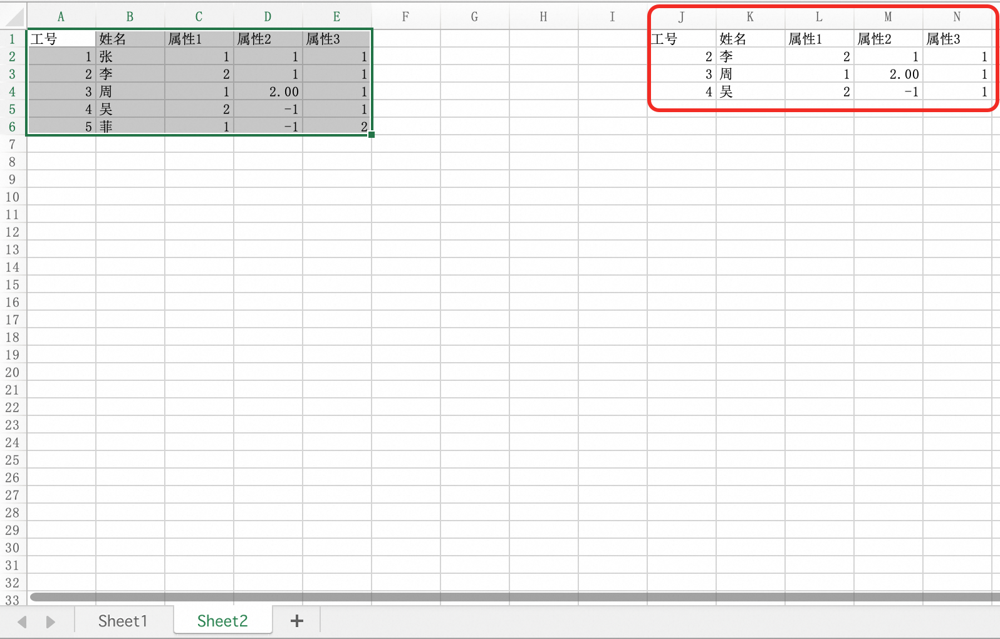

### 目的

存在如下表格，找出Sheet1中属性1、2、3单元格带颜色的人员，并检查这些人员在Sheet2中是否存在


### 思路

首先需要筛选出表格1中，带颜色的数据行，表示式为：`属性1` 或 `属性2` 或 `属性3` = 非无色，由于涉及到多个列的`或`运算，所以需要用到高级筛选功能

高级筛选不支持按颜色过滤，所以需要自行编写函数实现单元格颜色查询公式。

然后，找到带颜色的数据行后，同样使用高级筛选功能，以Sheet2为原始数据，以带颜色数据行工号为条件，再次筛选得到最终结果。

### 操作方法

#### 1. 编写单元格颜色查询公式

##### a. 打开Excel，然后按Alt键+F11键打开Viaual Basic编辑器，点击工具栏插入，下拉菜单点击模块。


##### b. 将单元格查询函数，复制到模块输入框中

```vbnet
Function GetCellColorCode(Optional ByRef cellRef As Range) As Long
    If Not cellRef Is Nothing Then
        GetCellColorCode = cellRef.Interior.ColorIndex
    Else
        GetCellColorCode = -1 ' 表示错误情况
    End If
End Function
```

效果如下


##### c. 保存VBA函数

表格保存格式必须选择启用宏的工作簿.xlsm，才能保证再次打开时，该函数仍生效（函数是绑定在文档上的，再新建表格此函数不生效）


#### 2. 筛选带颜色的数据行

##### a. 在Sheet1数据表旁边，填写筛选条件

红框所示内容为筛选条件，需要填写在Sheet1原数据表旁边，筛选条件含义为：`属性1有颜色` 或者 `属性2有颜色` 或者 `属性3有颜色`


👇**解释**👇

由于希望找出属性1、属性2、属性3任意一个单元格有颜色的行，则需要分3行写表达式（标题头不算）

如果表达式写在一行，则表示“与”的关系，即全部满足，才为筛选出来。例如下图


3个表达式单元格中，分别填写`=GetCellColorCode(C2)<>-4142`、`=GetCellColorCode(D2)<>-4142`、`=GetCellColorCode(E2)<>-4142`

以`=GetCellColorCode(C2)<>-4142`为例，含义是C2所在列的单元格颜色不为无色(-4142代表无色)

##### b. 使用高级筛选，对原数据过滤

选中原始数据，单击`高级筛选`按钮，在弹出的窗口中，分别指定原始数据区域（列表区域）、条件区域、结果区域（复制到），单击确定得到结果


筛选后的结果


#### 3. 筛选出Sheet2中与中间结果相同数据行

切换到Sheet2分页，选中Sheet2的原始数据，单击`高级筛选`按钮，在弹出的窗口中，分别指定Sheet2原始数据区域（列表区域）、条件区域、结果区域（复制到），单击确定即得到结果。


其中 条件区域，要选择 Sheet1 中的中间过滤结果的工号列，表示的含义为：在过滤条件中的任意工号，都筛选出来


最终筛选结果图



### 参考文档

https://zhuanlan.zhihu.com/p/36421139