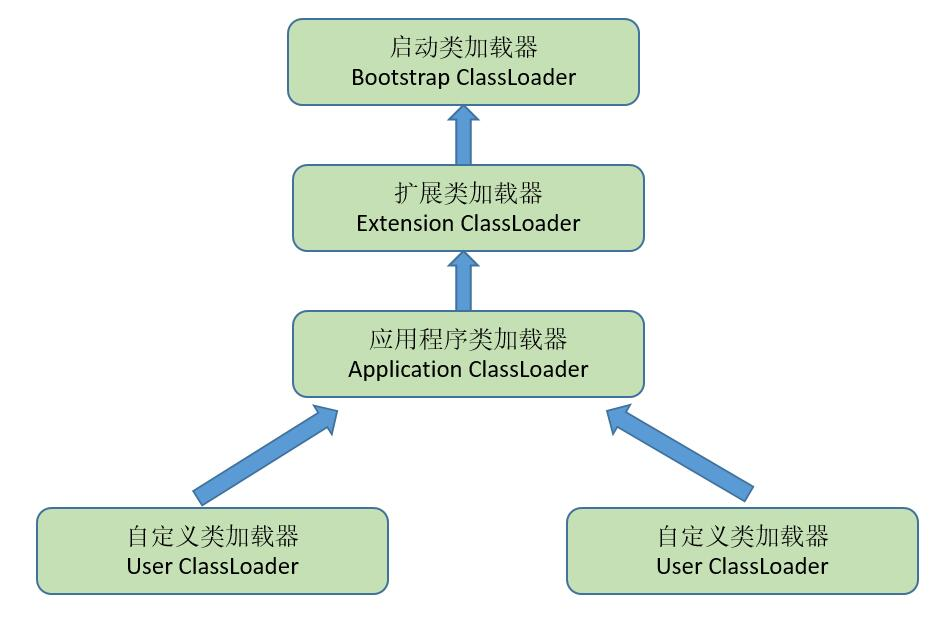

>  本文章回答的问题：
>
> 1、什么是双亲委派？ 2、为什么需要双亲委派，不委派有什么问题？ 3、"父加载器"和"子加载器"之间的关系是继承的吗？ 4、双亲委派是怎么实现的？ 5、我能不能主动破坏这种双亲委派机制？怎么破坏？ 6、为什么重写loadClass方法可以破坏双亲委派，这个方法和findClass（）、defineClass（）区别是什么？ 7、说一说你知道的双亲委派被破坏的例子 8、为什么JNDI、JDBC等需要破坏双亲委派？ 9、为什么TOMCAT要破坏双亲委派？ 10、谈谈你对模块化技术的理解吧！

### 1. 什么是双亲委派机制

双亲委派是一种规范机制。JVM在加载类的过程中需要使用ClassLoader进行加载，而在Java中，ClassLoader有很多，那么当JVM想要加载一个.class文件的时候，到底应该由哪个类加载器加载呢，答案就是双亲委派机制。

双亲委派机制：先**自下而上查找**.class是否被加载过，再**自上而下加载**目标.class



Java中提供的这四种类型的加载器，是有各自的职责的：

- Bootstrap ClassLoader ：主要负责加载Java核心类库，%JRE_HOME%\lib下的rt.jar、resources.jar、charsets.jar和class等。
- Extention ClassLoader：主要负责加载目录%JRE_HOME%\lib\ext目录下的jar包和class文件。
- Application ClassLoader：主要负责加载当前应用的classpath下的所有类
- User ClassLoader：用户自定义的类加载器,可加载指定路径的class文件

### 2. 双亲委派原理

源码见ClassLoader类

```java
// The parent class loader for delegation
private final ClassLoader parent; // 组合设计模式

protected Class<?> loadClass(String name, boolean resolve)
throws ClassNotFoundException
{
    synchronized (getClassLoadingLock(name)) {
        // First, check if the class has already been loaded
        Class<?> c = findLoadedClass(name); // 自下而上查找目标类是否加载过
        if (c == null) {
            long t0 = System.nanoTime();
            try {
                if (parent != null) {
                    c = parent.loadClass(name, false); // 自上而下加载目标类
                } else {
                    c = findBootstrapClassOrNull(name);
                }
            } catch (ClassNotFoundException e) {
                // ClassNotFoundException thrown if class not found
                // from the non-null parent class loader
            }

            if (c == null) {
                // If still not found, then invoke findClass in order
                // to find the class.
                long t1 = System.nanoTime();
                c = findClass(name);

                // this is the defining class loader; record the stats
                sun.misc.PerfCounter.getParentDelegationTime().addTime(t1 - t0);
                sun.misc.PerfCounter.getFindClassTime().addElapsedTimeFrom(t1);
                sun.misc.PerfCounter.getFindClasses().increment();
            }
        }
        if (resolve) {
            resolveClass(c);
        }
        return c;
    }
}
```

双亲委派模型中，类加载器之间的父子关系一般不会以继承（Inheritance）的关系来实现，而是都使用**组合（Composition）关系来复用父加载器**。

### 3. 为什么需要双亲委派

1. **避免类的重复加载**。父加载器已经加载过某一个类时，子加载器就不会再重新加载这个类。
2. **保证了安全性**。因为Bootstrap ClassLoader在加载的时候，只会加载JAVA_HOME中的jar包里面的类，如java.lang.Integer，那么这个类是不会被随意篡改。

### 4. 主动破坏双亲委派机制

**如何打破**：自定义ClassLoader，重写loadClass方法，但不依照往上开始寻找类加载器的方式，就算是打破双亲委派机制了

**为什么打破**：

① **实现类的隔离**，加载相同全限定名的类到不同的命名空间中，从而实现类的隔离；

② **支持热部署**，自定义的类加载器动态加载。

③ **加载特定来源的类**，从非传统的来源加载类，如从网络、数据库或加密存储中获取类字节码。

**有哪些案例**：

1. Tomcat：**隔离和热加载**

1. **隔离**不同应用程序的类库：一个 Tomcat 容器可能部署多个应用程序，不同应用程序可能依赖同一第三方类库的不同版本。每个 Web 应用都有自己的类加载器，优先加载自身应用目录下的类，避免不同应用程序之间的类冲突。
2. 实现类库共享：对于多个应用程序都需要的相同类库版本，可以设置为共享，避免重复加载，节省资源。
3. **隔离**容器和应用程序的类库：Tomcat 使用单独的类加载器装载自身的类库，防止应用程序的类库对Tomcat类库造成干扰，保证Tomcat的稳定性和安全性。
4. 支持**热部署**：为每个 JSP 文件单独创建类加载器，当 JSP 文件修改后，卸载之前的类加载器，重新加载新的类，实现 JVM 不重启情况下的热加载。

1. JDBC：**加载特定来源类**。一个类由ClassLoaderA加载，那么这个类的依赖类也是由该ClassLoader加载。DriverManager在java.sql包下，显然是由BootStrap类加载器进行装载，而BootStrap加载器无法加载用户自定义的驱动实现类，需要使用线程上下文类加载器来加载不同数据库类型的 Driver 实现类，以实现动态加载数据库驱动。
2. JNDI：**加载特定来源类**。与JDBC同理，启动类加载器无法加载SPI的外部代码。因此，Java 引入线程上下文类加载器，JNDI 服务可以使用它来加载所需的 SPI 代码，从而打破了双亲委派机制。
3. OSGI：**隔离和热加载**。OSGi 框架允许动态加载和卸载模块，每个模块都有自己的类加载器。通过打破双亲委派机制，OSGi 框架可以实现模块之间的隔离和动态更新，在更换模块时，可将模块与类加载器一起更换，实现模块化热部署。

### 5. 最新版本

在JDK9中，整个JDK都基于模块化进行构建，以前的rt.jar, tool.jar被拆分成数十个模块，编译的时候只编译实际用到的模块，同时各个类加载器各司其职，只加载自己负责的模块。

```java
Class<?> c = findLoadedClass(cn);
if (c == null) {
    // 找到当前类属于哪个模块
    LoadedModule loadedModule = findLoadedModule(cn);
    if (loadedModule != null) {
        //获取当前模块的类加载器
        BuiltinClassLoader loader = loadedModule.loader();
        //进行类加载
        c = findClassInModuleOrNull(loadedModule, cn);
     } else {
          // 找不到模块信息才会进行双亲委派
            if (parent != null) {
              c = parent.loadClassOrNull(cn);
            }
      }
}
```