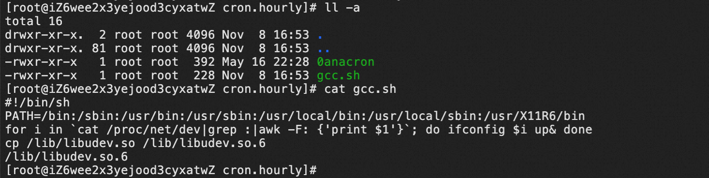
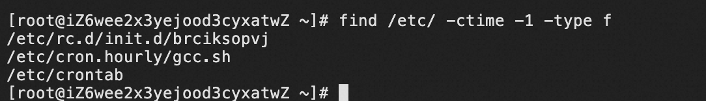

# 1. 现象

- 云平台出现告警，提醒在/usr/bin中存在恶意进程
- 按找路径找到/usr/bin发现仍有乱字母的可执行文件，手动删除后，过会又出现

# 2. 排查思路

1. 基于删除又会出现，说明有定时任务，可排查3个地方：crontab、cron、进程(守护进程)
2. 执行`crontab -l`，查看是否存在定时任务。ps：该命令检查的是`/var/spool/cron`
3. 检查cron日志`tail -f /var/log/cron`中是否有定时任务执行的日志，发现有0anacron和gcc.sh在执行

```plain
Nov  8 16:50:01 iZ6wee2x3yejood3cyxatwZ CROND[17834]: (root) CMD (/usr/lib64/sa/sa1 1 1)
Nov  8 17:00:01 iZ6wee2x3yejood3cyxatwZ CROND[20186]: (root) CMD (/usr/lib64/sa/sa1 1 1)
Nov  8 17:01:01 iZ6wee2x3yejood3cyxatwZ CROND[20326]: (root) CMD (run-parts /etc/cron.hourly)
Nov  8 17:01:01 iZ6wee2x3yejood3cyxatwZ run-parts(/etc/cron.hourly)[20326]: starting 0anacron
Nov  8 17:01:01 iZ6wee2x3yejood3cyxatwZ run-parts(/etc/cron.hourly)[20335]: finished 0anacron
Nov  8 17:01:01 iZ6wee2x3yejood3cyxatwZ run-parts(/etc/cron.hourly)[20326]: starting gcc.sh
Nov  8 17:01:02 iZ6wee2x3yejood3cyxatwZ run-parts(/etc/cron.hourly)[20350]: finished gcc.sh
Nov  8 17:10:01 iZ6wee2x3yejood3cyxatwZ CROND[21222]: (root) CMD (/usr/lib64/sa/sa1 1 1)
Nov  8 17:20:01 iZ6wee2x3yejood3cyxatwZ CROND[21986]: (root) CMD (/usr/lib64/sa/sa1 1 1)
Nov  8 17:30:01 iZ6wee2x3yejood3cyxatwZ CROND[22548]: (root) CMD (/usr/lib64/sa/sa1 1 1)
```

4. 检查0anacron无问题，同时根据文件修改时间判断非近期修改。检查gcc.sh发现存在问题，根据文件修改时间判断是最近修改，其中libudev.so是病毒源，根据该文件时间判断也是最新创建的。



该代码逻辑：打开网卡，复制病毒源，并执行该病毒库。该gcc.sh是如何定时执行的呢？

5. 检查`/etc/crontab`文件发现有定时任务，每3分钟执行一次gcc.sh脚本，所以基本定位清楚了。

6. **除此之外，很重要一点**，再根据时间查询近期修改的文件`find /etc/ -ctime -1 -type f`，发现在/etc/init.d/中还有其他病毒脚本



7. 再检查进程，发现这些脚本一启动就会被云平台kill掉，无法通过`strace -tt -p {pid}`跟踪，也无法根据/proc/{pid}查看进程信息，但根据上文基本定位到病毒的启动方式和本体了

# 3. 处理方式

一般直接kill并不能杀死病毒进程，因为脚本可以根据SIGAL TERM结束指令后会尝试在/usr/bin生成新病毒；

需要考虑到，病毒在定时任务、进程同时存在，必须阻断病毒相互勾连，连根拔起，所以处理思路是：删除病毒文件+锁定目录+清理进程的方式。

1. 删除`/etc/crontab`的定时任务，并`chattr +i /etc/crontab`锁定文件禁止写入
2. 删除`rm -f /etc/cron.hourly/gcc.sh && chattr +i -f /etc/cron.hourly`锁定目录禁止写入
3. 清理病毒源`rm -f /lib/libudev.so && chattr +i -f /lib`锁定目录禁止写入
4. 清理bin和etc中的各种脚本
   1. `find /bin/ -ctime 0 | xargs rm -f && chattr +i -f /bin``
   2. ``find /etc/ -ctime 0 -type l | xargs rm -f && chattr -R +i /etc/rc.d`

5. 禁止其他高风险目录写入`chattr +i -f /lib64 /sbin /usr/local`
6. 关闭机器（不要重启）
7. 恢复锁定目录和文件`chattr -i -R -f /usr/bin /lib /lib64 /etc/init.d /etc/rc.d /etc/crontab /etc/cron.hourly /usr/sbin /usr/local`