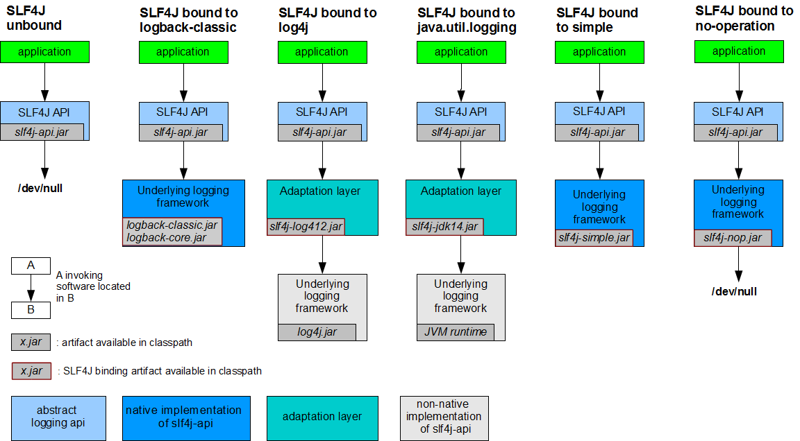
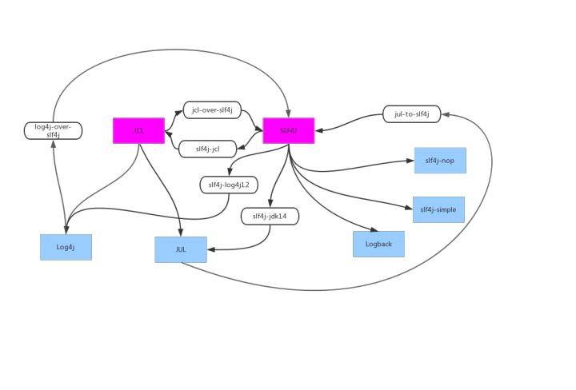

> 原文：https://whatsrtos.github.io/Java/JavaEE-Log/
# 日志框架简介

- `Commons Logging`和`SLF4J`是java中的 *日志门面*，即它们提供了一套通用的接口，具体的实现可以由开发者自由选择。
- `Log4j`（以及最新的log4j 2）和`Logback`则是具体的 *日志实现* 方案。它们可以理解为接口与实现类的关系
- 四个框架都可以在程序中使用，但是为了考虑扩展性，一般我们在程序开发的时候，会选择使用Commons Logging或者SLF4J这些日志门面，而不是直接使用log4j或者Logback这些实现。即我们写代码的时候导入的类一般都是来自门面框架中的类，然后将某个日志的实现框架加入到项目中，提供真正的日志输出功能。
  如果项目依赖多个库，这些库又使用了不同的日志门面，这种情况可以方便的通过 Adapter 转接到同一个日志实现上；
- 比较常用的搭配是:
  1. commons-logging + log4j，这是一种比较老但稳妥的组合, 缺点是commons-logging不支持占位符;
  2. slf4j + logback，slf4j支持占位符, logback性能优于log4j;

# 日志门面（SLF4J，Commons-Loggings）

## SLF4J

SLF4J全称为`Simple Logging Facade for JAVA`，Java简单日志门面。
类似于Commons Logging，是对不同日志框架提供的一个门面封装，可以在部署的时候不修改任何配置即可接入一种日志实现方案。

### Adapter & Bridge

SLF4J在编译时静态绑定真正的Log库。下图介绍了SLF4J如何绑定具体的日志实现的:



对于application层，具体的日志框架对我们都是透明的，我们只针对slf4j-api编程。应用程序调用slf4j-api，而日志的输出最终是由底层的日志实现（Log4j、Logback）来负责的。
上图也说明了具体日志实现（Log4j、Logback）的不同：

- Logback是基于slf4j接口编写的，所以中间不需要适配：`SLF4J` -> `Logback`
- SLF4J+Log4j的方式就需要适配层：`SLF4J` -> `slf4j-log4j12` -> `Log4j`

SLF4J是如何绑定具体日志实现，参考：
[slf4j初始化绑定源码分析 | Sky’s Blog](http://skyao.github.io/2014/07/21/slfj4-binding/) @Ref

**混乱的开始**：

SLF4J的开发者提供了各种 Adapter 和 Bridge 来适配各种 Log Implementation 和 Log Facade，使用JCL作为日志门面的旧项目也可以接入SLF4J。
甚至可以有: Facade1 -> Implementation1 -> Bridge -> Facade2 -> Implementation2这种复杂的桥接方式.
比如程序中以前使用的日志门面是commong-logging，那么你可以通过引入jcl-over-slf4j包来讲日志重定向到slf4j。


上图中红色的是 Log Facade， 蓝色的是 Log Implementation ，所以有了以下几种可能的复杂桥接方案:

- `JCL`(Commons Logging) -> `jcl-over-slf4j` -> `SLF4J` -> `Logback`
- `Log4j` -> `log4j-over-slf4j` -> `SLF4J` -> `Logback`

> 从上面可以看出, `SLF4J` -> `Logback`是最简单的方案, `SLF4J`想使用 `Log4j`就需要桥接包

### 日志占位符

SLF4J提供了更好的日志记录方式，支持占位符的方式打印日志。比如：
`logger.debug("Processing trade with id: {} and symbol : {} ", id, symbol);`

而不是使用JCL的`+`的方式：
`logger.debug("start process request, url:" + url);`
直接使用 `+` 拼接字符串有什么问题呢？一般生产环境 log 级别都会设到 info 或者以上，那这条 log 是不会被输出的。
然而不管是否输出，上面的代码都会做一个字符串连接操作，然后生产一个新的字符串。
如果这条语句在循环或者被调用很多次的函数中，就会多做很多无用的字符串连接，影响性能。

所以 JCL 的最佳实践推荐这么写：

```java
if (logger.isDebugEnabled()) {
    logger.debug("start process request, url:" + url);
}
```


然而开发者常常忽略这个问题或是觉得麻烦而不愿意这么写。所以SLF4J提供的占位符`{}`方式更加方便。

### SLF4J + Logback（推荐）

SLF4J是编译时绑定到具体的日志框架，性能优于采用运行时搜寻的方式的commons-logging
SLF4J提供了更好的日志记录方式，带来下这几方面的好处：

更好的可读性；

不需要使用`logger.isDebugEnabled()`来解决日志因为字符拼接产生的性能问题。比如：
`logger.debug(“Processing trade with id: {} and symbol : {} “, id, symbol);`
logback支持了更方便的自定义日志，便于后期的日志分析，可以将日志格式化保存到各种存储引擎中，请点击这里 可以将日志写入到HBase等。但是SLF4J不支持FATAL级别

使用slf4j + logback步骤:

- 添加slf4j + logback的Jar包依赖;

  - 去掉commons-loggings和log4j的依赖, 用`mvn dependency:tree`查看依赖, 并用`<exclusions>`去掉Jar依赖;
  - 去掉重复引入的logback相关Jar, 比如我们使用slf4j + logback的方案，只需要引入`logback-classic`即可，不必再显示添加`slf4j-api`和`logback-core`，因为logback-classic本身依赖它们。

- slf4j 配置文件: 无

- logback 配置文件: logback.xml

- Java代码:

  ```java
  import org.slf4j.Logger;
  import org.slf4j.LoggerFactory;
  
  public class A {
      private static final Logger logger = LoggerFactory.getLogger(A.class);
      public static void main(String[] args) {
          if(logger.isDebugEnabled()){
              logger.debug("slf4j-logback debug message");
          }
          if(logger.isInfoEnabled()){
              logger.info("slf4j-logback info message");
          }
          if(logger.isTraceEnabled()){
              logger.trace("slf4j-logback trace message");
          }
      }
  }
  ```

> @Ref: [slf4j+logback的配置及使用 - 简书](https://www.jianshu.com/p/696444e1a352)

## Commons Logging（JCL）

Commons Logging是一个通用的日志接口。在有些地方会看到简写为JCL（Jakarta Commons Logging）。

> commons-logging是Apache commons类库中的一员。Apache commons类库是一个通用的类库，提供了基础的功能，比如说commons-fileupload，commons-httpclient，commons-io，commons-codes等。

common-logging通过动态查找的机制，在程序运行时自动找出真正使用的日志库。
用户可以自由选择第三方的日志组件作为具体实现，像log4j，或者jdk自带的logging， Commons Logging会通过动态查找的机制，在程序运行时自动找出真正使用的日志库。
所以使用Commons Logging，通常都是配合着log4j来使用。使用它的好处就是，代码依赖是Commons Logging而非log4j， 避免了和具体的日志方案直接耦合，在有必要时，可以更改日志实现的第三方库。

工作原理：

1. 查找名为org.apache.commons.logging.Log的factory属性配置（可以是java代码配置，也可以是commons-logging.properties配置）；
2. 查找名为org.apache.commons.logging.Log的系统属性；
3. 上述配置不存在则classpath下是否有Log4j日志系统，如有则使用相应的包装类；
4. 如果系统运行在JDK 1.4系统上，则使用Jdk14Logger；
5. 上述都没有则使用SimpleLog。

所以如果使用commons-logging＋log4j的组合只需要在classpath中加入log4j.xml配置即可。commons-logging的动态查找过程是在程序运行时自动完成的。他使用ClassLoader来寻找和载入底层日志库，所以像OSGI这样的框架无法正常工作，因为OSGI的不同插件使用自己的ClassLoader。

### Commons-Logging + Log4j

> 日志门面为Commons-Logging（JCL），实现类为log4j。Commons-Logging会通过动态查找的机制，在程序运行时自动找出真正使用的日志库。只要应用系统引入了log4j.jar包 并在classpath 配置了log4j.xml ，则Commons-Logging 就会使log4j 使用正常，而代码里不需要依赖任何log4j 的代码。

使用commons-logging + log4j的步骤:

- 添加Jar包依赖;

- commons-logging 配置文件: 默认的，common-logging会自动检查是否使用log4j，也可以使用配置文件显示的启用log4j。配置文件为`commons-logging.properties`,放在classpath下;

  ```properties
  org.apache.commons.logging.Log=org.apache.commons.logging.impl.Log4J-Logger
  org.apache.commons.logging.LogFactory=org.apache.commons.logging.impl.LogFactoryImpl
  ```

- log4j 配置文件: `log4j.properties`:

  ```properties
  log4j.rootLogger=DEBUG,console
  log4j.appender.console=org.apache.log4j.ConsoleAppender
  log4j.appender.console.layout=org.apache.log4j.PatternLayout
  log4j.appender.console.layout.ConversionPattern=[%-d{yyyy-MM-dd HH:mm:ss}]-[%t-%5p]-[%C-%M(%L)]： %m%n
  ```

- Java代码:

  ```java
  import org.apache.commons.logging.Log;
  import org.apache.commons.logging.LogFactory;
  
  public class A {
      private static Log logger = LogFactory.getLog(this.getClass());
      public static void main(String[] args) {
          logger.debug("Debug info: " + args.toString());
      }
  }
  ```

参考: [Jakarta Commons Logging Users Guide](https://svn.apache.org/repos/asf/commons/proper/logging/tags/STRUTS_1_1_B3/usersguide.html) @Ref

# 日志实现（Log4J，LogBack，JUL）

主流的日志实现有 log4j（还有升级版log4j2）和logback, 实现了将日志输出到具体的介质, 比如文件/Tcp/Scribe等.
此外还有`java.util.logging`（JUL）

- log4j的默认配置文件是 log4j.properties;
- logback的默认配置文件是 logback.xml;

## Log4j

Log4j是Apache的一个开放源代码项目，经典的一种日志解决方案。内部把日志系统抽象封装成Logger 、appender 、pattern等实现。
我们可以通过配置文件轻松的实现日志系统的管理和多样化配置。
通过使用Log4j，我们可以控制日志信息输送的目的地是控制台、文件、GUI组件、甚至是套接口服务器、NT的事件记录器、UNIX Syslog守护进程等；用户也可以控制每一条日志的输出格式；
通过定义每一条日志信息的级别，用户能够更加细致地控制日志的生成过程。这些可以通过一个 配置文件来灵活地进行配置，而不需要修改程序代码。

### Quick Start

配置文件加载顺序:

- log4j.xml
- log4j.properites

所以把log4j.xml或log4j.properties放在这些目录下，那么log4j会“自动去加载”到，不用程序里手工写加载代码了。这也就“约定大于配置的好处”。

### 配置文件 log4j.properties

配置文件log4j.properties 结构&层级如下:

```yml
logger
    appender
        layout
```

- Loggers(记录器)：记录日志的工具，程序中就是用它来记录我们想要的日志信息。
- Appenders (输出源)：日志输出到什么地方，可以是控制台、文件、流位置、数据库，等等。
- Layouts(布局模式)：日志需要记录哪些基本信息，用什么样的格式去记录展示这些信息。
- 一个 Logger 最少要有一个 Appender，一个 Appender 有一个 Layout。

log4j.properties 示例:

```properties
log4j.rootLogger=INFO,A1               // 定义logger方式1: 定义根logger名=rootLogger, level=INFO, 使用名为A1的appender
log4j.logger.loggerName1=DEBUG,A2      // 定义logger方式2: logger名=loggerName1, 使用名为A2的appender
log4j.logger.org.apache = DEBUG, A3   // 定义logger方式3: 对org.apache下的类有效, 使用名为A3的appender

// 定义A1 appender的属性
log4j.appender.A1=org.apache.log4j.DailyRollingFileAppender // 可选ConsoleAppender, RollingFileAppender ..
log4j.appender.A1.BufferedIO=false
log4j.appender.A1.BufferSize=1024
log4j.appender.A1.file=../logs/api.log // 日志文件位置
log4j.appender.A1.DatePattern='.'yyyyMMddHH
log4j.appender.A1.layout=org.apache.log4j.PatternLayout
log4j.appender.A1.layout.ConversionPattern=%-d{yyyy-MM-dd HH\:mm\:ss SSS} [%p] %m%n // 日志格式
```

### 代码

```java
public class Test {

    // 获取rootLogger方法:
    public static Logger rootLogger = Logger.getRootLogger();
    // 从logger名字获取:
    private static Logger log = Logger.getLogger("loggerName1");
    // 从class获取
    private static Logger log2 = Logger.getLogger(Test.class);

    public static void main(String[] args) {
        log.info("......");
    }
}
```

### 性能问题

- 设置日志缓存，以及缓存大小

  ```properties
  log4j.appender.A3.BufferedIO=true
  #Buffer单位为字节，默认是8K，IO BLOCK大小默认也是8K
  log4j.appender.A3.BufferSize=8192
  ```

- 设置日志输出为异步方式 (异步输出必须使用xml方式配置才能支持)

  ```xml
  <appender name="DAILY_FILE" class="org.apache.log4j.DailyRollingFileAppender">
      <layout class="org.apache.log4j.PatternLayout">
      <param name="ConversionPattern" value="%d{yyyy-MM-dd HH:mm:ss,SSS} %5p %c %x - %m%n"/>
      </layout>
      <param name="File" value="log/log4j.log"/>
      <param name="DatePattern" value="'.'yyyy-MM-dd"/>
  </appender>
  
  <appender name="ASYNC_FILE" class="org.apache.log4j.AsyncAppender">
      <param name="BufferSize" value="10000"/>
      <param name="Blocking" value="false"/>
      <appender-ref ref="DAILY_FILE"/>
  </appender>
  ```

Log4j的AsyncAppender存在的问题:

> Log4j的异步appender也就是AsyncAppender存在性能问题（现在Log4j 2.0 RC提供了一种新的异步写log的机制(基于disruptor)来试图解决问题），
> 异步写log有一个buffer的设置，也就是当队列中多少个日志的时候就flush到文件或数据库，
> 当配置为blocking=true的时候，如果应用写日志很快，log4j的缓冲队列将很快被占满，写日志会被阻塞

## Logback

Logback也是一种日志实现。Logback是由log4j创始人设计的又一个开源日记组件。
Logback当前分成三个模块：Logback-core,Logback- classic和Logback-access。Logback-core是其它两个模块的基础模块。Logback-classic是log4j的一个 改良版本。
此外Logback-classic完整实现SLF4J API使你可以很方便地更换成其它日记系统如log4j或JDK14 Logging。
Logback-access访问模块与Servlet容器集成提供通过Http来访问日记的功能。

LogBack 作为一个通用可靠、快速灵活的日志框架，将作为Log4j 的替代和SLF4J 组成新的日志系统的完整实现。官网上称具有极佳的性能，在关键路径上执行速度是log4j 的10 倍，且内存消耗更少。比如判定是否记录一条日志语句的操作，其性能得到了显著的提高。这个操作在LogBack中需要3纳秒，而在Log4J中则需要30纳秒。 LogBack创建记录器（logger）的速度也更快：13微秒，而在Log4J中需要23微秒。更重要的是，它获取已存在的记录器只需94纳秒，而 Log4J需要2234纳秒，时间减少到了1/23。”。

官方文档对logback的描述

> NATIVE IMPLEMENTATION There are also SLF4J bindings external to the SLF4J project, e.g. logback which implements SLF4J natively. Logback’s ch.qos.logback.classic.Logger class is a direct implementation of SLF4J’s org.slf4j.Logger interface. Thus, using SLF4J in conjunction with logback involves strictly zero memory and computational overhead.

可以看到logback是直接实现了slf4j的接口，是不消耗内存和计算开销的。而log4j不是对slf4j的原生实现，所以slf4j api在调用log4j时需要一个适配层。

### Quick Start

@TODO

### 配置文件 logback.xml

logback在启动时，根据以下步骤寻找配置文件：

- ①在classpath中寻找logback-test.xml文件
- ②如果找不到logback-test.xml，则在 classpath中寻找logback.groovy文件
- ③如果找不到 logback.groovy，则在classpath中寻找logback.xml文件

如果上述的文件都找不到，则logback会使用JDK的SPI机制查找 `META-INF/services/ch.qos.logback.classic.spi.Configurator`中的 logback 配置实现类，这个实现类必须实现Configuration接口，使用它的实现来进行配置。
如果上述操作都不成功，logback 就会使用它自带的 BasicConfigurator 来配置，并将日志输出到console。

```xml
<?xml version="1.0" encoding="UTF-8"?>
<!--scan:
            当此属性设置为true时，配置文件如果发生改变，将会被重新加载，默认值为true。
scanPeriod:
            设置监测配置文件是否有修改的时间间隔，如果没有给出时间单位，默认单位是毫秒。当scan为true时，此属性生效。默认的时间间隔为1分钟。
debug:
            当此属性设置为true时，将打印出logback内部日志信息，实时查看logback运行状态。默认值为false。

configuration 子节点为 appender、logger、root

            -->
<configuration scan="true" scanPeriod="60 seconds" debug="false">
    <!--用于区分不同应用程序的记录-->
    <contextName>edu-cloud</contextName>
    <!--日志文件所在目录，如果是tomcat，如下写法日志文件会在则为${TOMCAT_HOME}/bin/logs/目录下-->
    <property name="LOG_HOME" value="logs"/>

    <!--控制台-->
    <appender name="stdout" class="ch.qos.logback.core.ConsoleAppender">
        <encoder>
            <!--格式化输出：%d表示日期，%thread表示线程名，%-5level：级别从左显示5个字符宽度 %logger输出日志的logger名 %msg：日志消息，%n是换行符 -->
            <pattern>[%d{yyyy-MM-dd HH:mm:ss.SSS}] [%thread] %-5level %logger{36} : %msg%n</pattern>
            <!--解决乱码问题-->
            <charset>UTF-8</charset>
        </encoder>
    </appender>

    <!--滚动文件-->
    <appender name="infoFile" class="ch.qos.logback.core.rolling.RollingFileAppender">
        <!-- ThresholdFilter:临界值过滤器，过滤掉 TRACE 和 DEBUG 级别的日志 -->
        <filter class="ch.qos.logback.classic.filter.ThresholdFilter">
            <level>INFO</level>
        </filter>
        <rollingPolicy class="ch.qos.logback.core.rolling.TimeBasedRollingPolicy">
            <fileNamePattern>${LOG_HOME}/log.%d{yyyy-MM-dd}.log</fileNamePattern>
            <maxHistory>30</maxHistory><!--保存最近30天的日志-->
        </rollingPolicy>
        <encoder>
            <charset>UTF-8</charset>
            <pattern>[%d{yyyy-MM-dd HH:mm:ss.SSS}] [%thread] %-5level %logger{36} : %msg%n</pattern>
        </encoder>
    </appender>
<!--这里如果是info，spring、mybatis等框架则不会输出：TRACE < DEBUG < INFO <  WARN < ERROR-->
    <!--root是所有logger的祖先，均继承root，如果某一个自定义的logger没有指定level，就会寻找
    父logger看有没有指定级别，直到找到root。-->
    <root level="debug">
        <appender-ref ref="stdout"/>
        <appender-ref ref="infoFile"/>
        <appender-ref ref="errorFile"/>
        <appender-ref ref="logstash"/>
    </root>
</configuration>
```

## JUL

java.util.logging 是 java自带的日志处理系统, 配置文件一般是logging.properties,

`java.util.logging.LogManager` 负责读取配置, LogManager 还可以根据两个系统属性来允许用户控制日志的配置：

- “-Djava.util.logging.config.class=YourClass”
- “-Djava.util.logging.config.file=logging.properties”

### logging.properties

和Tomcat的配置格式类似:

```properties
handlers=java.util.logging.FileHandler,java.util.logging.ConsoleHandler,
java.util.logging.ConsoleHandler.level=WARNING
java.util.logging.ConsoleHandler.formatter=java.util.logging.SimpleFormatter

java.util.logging.FileHandler.level=INFO
java.util.logging.FileHandler.formatter=java.util.logging.SimpleFormatter
java.util.logging.FileHandler.limit=1024000
java.util.logging.FileHandler.count=10
java.util.logging.FileHandler.pattern=/data1/logs/log.%d{yyyyMMddHH}
java.util.logging.FileHandler.append=true
```

# 最佳实践

如果你的项目是一个库，需要提供给给别的项目使用，那么建议使用Log Facade，而不使用具体的 Log Implementation。
如果一定要使用 Log Implementation，
那么建议你的项目里对 Log Implementation 的依赖设置为`<scope>runtime</scope>` 并且`<optional>true</optional>`, 设为optional，依赖不会传递；

```xml
<dependency>
    <groupId>org.apache.logging.log4j</groupId>
    <artifactId>log4j-core</artifactId>
    <version>${log4j.version}</version>
    <scope>runtime</scope>
    <optional>true</optional>
</dependency>
<dependency>
    <groupId>org.apache.logging.log4j</groupId>
    <artifactId>log4j-slf4j-impl</artifactId>
    <version>${log4j.version}</version>
    <scope>runtime</scope>
    <optional>true</optional>
</dependency>
```

如果是一个独立的项目(比如Web项目)，
那么不要单独使用 Log Impementation，而应该跟 Log Facade一起使用。

**如果有必要, 排除依赖的第三方库中的 Log Impementation依赖**

这是很常见的一个问题，第三方库的开发者未必会把具体的 *Log Implementation* 或者桥接器的依赖设置为optional，然后你的项目会继承这些 *Log Implementation* 的库，
—— 但这未必是你想使用的，比如第三方库依赖了Log4j，但你自己的项目使用的是Logback。
另外，如果不同的第三方依赖使用了不同的桥接器和 *Log Implementation* ，也极容易形成依赖环。项目里就需要针对每个 *Log Implementation* 库都都写一个配置文件。
这种情况下推荐的处理方法，使用exclude来排除所有的这些 *Log Implementation* 和桥接器的依赖，只保留第三方库里面对 *Log Facade* 的依赖。