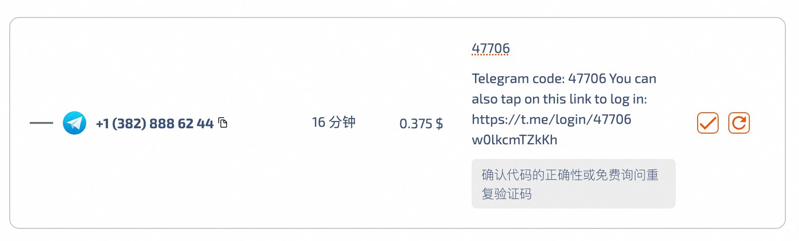

## 机器

注册AWS账号

创建EC2

```bash
# v2ray脚本需要用root安装，所以要给root设置密码，用该用户登录
$ sudo passwd root
# njzcx
$ su root
```

## v2ray

安装v2ray

https://github.com/v2fly/fhs-install-v2ray

```plain
$ bash <(curl -L https://raw.githubusercontent.com/v2fly/fhs-install-v2ray/master/install-release.sh)
```

启动v2ray

```plain
systemctl start v2ray
```

查看v2ray状态，从响应中拿到config.json位置

```plain
systemctl status v2ray
```

配置config.json

https://toutyrater.github.io/basic/vmess.html

```json
{
  "inbounds": [
    {
      "port": 8888, // 服务器监听端口
      "protocol": "vmess",    // 主传入协议
      "settings": {
        "clients": [
          {
            "id": "6d4caa82-7cb1-11ee-b962-0242ac120002",  // 用户 ID，客户端与服务器必须相同
            "alterId": 64
          }
        ]
      }
    }
  ],
  "outbounds": [
    {
      "protocol": "freedom",  // 主传出协议
      "settings": {}
    }
  ]
}
```

## 接码平台

sms-activate.org

ID: 12531399：gmail/数字Zcx

