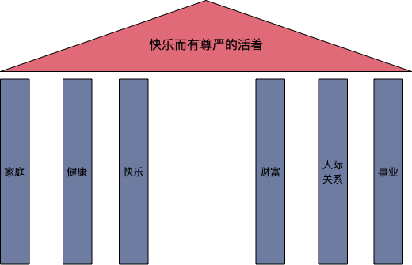

工作10来个年头，从以前的对主管的各种敬畏、不满、不服，每当遇到不顺心时作为下属的我，当时就心想如果要是我当上了主管一定会做的更好。到现在自己成为了主管已经5年，遇到下属的不理解、不配合和不上进时，其实当面对每一件琐碎事情时，自己的处理并不比别人好多少？所以知道自己不知道，才能打开自己去吸收外面好的能量进来完善自己。这5年来我也一直是这么要求自己，不停的观察身边的好的TL，从中吸收、总结和抽象他们身上的特质，从而学习他们提升自己，我也非常感谢那些给我帮助和教训的周围的主管们。

## 以终为始

（**什么是目的、什么是手段、什么是原因、什么是结果、该保什么、该放弃什么？**）

以终为始可能是我这些年学到的最重要的思维模式之一，因为他是一种终局思维，他会逼着你做事和思考问题之前，要考虑这个事情你的初心和目标是什么？初心和目标真的非常重要，因为在我们的现实世界中，会有非常多的时候会陷入选择困难和迷茫中，他是你最终走出这些困难的指南针。出发之前想清楚那个终点是不是你最终想要的，可以让你在路上遇到困难时更加坚定和勇往无前。

#### 区分目的和手段

要做到以终为始，首先要能分辨什么是目标，我们现实中很容易把目标和实现目标的手段混淆，错把手段当成目标。例如我们想过我们工作的目标是什么吗？大家自然会说工作是为了赚钱啊，那赚钱的目的是干啥？是买房、买车、给家人好的生活？什么才是好的生活？是大房子、豪车、每天山珍海味这样的生活就一定是好生活吗？恐怕不一定，父母需要你的沟通、孩子需要你的陪伴，没有和谐的家庭再多钱也换不来幸福。你现在回忆一下你最幸福的时光，是你拥有金钱最多的时候吗？所以我们工作是我们赚钱的手段之一，而赚钱也是我们获取快乐和幸福的手段。当然你也许会和我抬杠例如也有很多人工作本身就很快乐，没关系我们古人通过儒、释、道思想已经给我们解释的很清楚了。

当我们把快乐和尊严作为我们终极追求的目标时，我们要看看有哪些能够帮助我们达到这些目标，当有一天其中一个柱子到了后，我们还有其他支撑，所以不需要感觉世界崩塌了，你还有健康、家庭等。

 

回到管理，我们要问自己管理的初心是什么？是通过管理别人来完成工作；是一群有情有义的人一起做一件有意义的事；是动员群众解决难题；是“使众人行”；关于管理的定义有很多，在我看来，管理或者领导力的核心是聚志同道合（非群众是因为管理成本低、效率更高）的人解决难题。就是阿里讲的一张图、一颗心、一场仗，我回来带商品和库存团队，首先想的一件事情就是，商品域要建设成什么样子才是我们想要的。我们经过几个月的讨论，得出来“商品要像血液一样在阿里经济体内健康、通畅和智慧的流淌”的愿景。

- 健康：首先要能对丰富的现实和虚拟世界中的货有准确的描述，其次这些货是符合其客观的运行规律的，再次我们对他要有监测指标体系，并能保证他持续的变好。
- 通畅：打通商品在经济体流通渠道收敛商品数据写入和读取渠道，让商品模型和承载的语义信息在各个市场认可和消费
- 让好商品在合适的市场中更容易的被发现和被消费

我们需要一个什么的团队才能达到这个目标呢？我觉得他需要这3个特质：稳定、专业和服务。

- 稳——系统的稳定性是立命之本，没有前面的1后面再多的0都没用
- 专——我们要成为全球对商品域理解最深，最专业的团队
- 快——我们是个基础服务，对外合作要高效，我们要成为前台业务的加速器而不是瓶颈

商品规划图

所以我也在不停的按照这个思路在实践，也是在实践中学习和改进。

#### 区分原因和结果

以终为始的思维还要注意区分做事中的原因和结果的顺序。例如我们去参加晋升是因为能力得到了提升，晋升是能力提升的结果，而不是希望你提升能力所以才晋升你。当然因和果也是可以相互转化的，再如我在[《以业务视角来看中台建设》](https://www.atatech.org/articles/187396)讲到中台的增长飞轮中提到我们中台是因为做的好才会有很多人来用，还是因为我们有很多人来才会做的好。哪个是因哪个是果？这种恐怕就是互为因果了。

 

#### 分清主次

当我们面临多目标选择时，往往无法抉择，左右摇摆。例如当你遇到这样一个场景：外部一家有潜力的公司要挖你，现金给你差不多，但是总包也不少，但是这家公司的股票目前看来有很大的增值空间。总包在未来的1-2年很可能涨个2-3倍。但是你也面临一些风险：

- 1是虽然这家公司目前风头正劲，但是也不排除有黑天鹤；
- 2是现在的公司可能给你竞业，即使过去也面临被追诉的风险；
- 3是你过去单枪匹配能不能生存。这种场景恐怕阿里很多人都遇到过，你该如何选择？

你可以往最好和最坏的结果去想，例如最好的结果就是股票增值3倍，每年增加个几百万，这个最好的结果你能给你带来什么改变，你的生活变化大吗？同样你也想想可能什么是最坏的结果，例如你可能丢掉你现在稳定的收入，你可能在新的环境工作很不开心，当你遇到这最坏的结果时你能不能承受。当你把最好的和最坏的结果都想到的时候，当前或者未来一段时间哪个才是你主要想要保证的？是一大笔钱还是在当前的环境里继续提升自己的能力，想清楚主次的追求你的选择可能就简单了。

如上图如果是在第一和第三象限那就是最理想的情况，如果是第二和第四象限的话，那选择就不是最好的选择了。

## 系统性思维

刚做主管时，就从身边的管理者学到了TL必须具有系统性思维做事才靠谱，我们把公司的组织形态看成一种网状结构的话，那么TL就是其中的交汇的一个重要节点。如果是一个重要的节点他必然受到多个方向的拉力的影响，所以要平衡好各个方向的力的平衡，否则要么被各个方向的力来回拉扯失去自我，要么被某些方向的力拉的太远而失去平衡导致自己的节点被分裂而断掉。如何做好这个平衡就要具有系统性思维。

#### 思考全面

所谓思考全面有3个层面：

1. 一个是对事情本身的思考要全面，例如做库存写的单元化，要思考清楚各种边界触发条件，各种面临的场景如直播秒杀下库存快速扣完，大促场景下临时的混部机房，故障容灾时的机房流量切换对多个单元库存扣减的影响，这些因素都要思考清楚。
2. 另外一个层面是做事还要考虑清楚对不同合作团队的影响，例如做库存单元化会影响到数据库团队、单元化运维团队、大促保障团队、测试团队等，这些团队对这个方案是什么态度，是否得到他们的认可和支持，站在他们的视角看自己，有没有吸取他们的意见，把他们变成合作方而非阻力方。
3. 要带有生态思维思考，因为所有的事情都不是孤立存在的，他一定有处在一定的环境中，所以不仅要考虑事情本身的影响，还要考虑改变这件事件对其环境的影响。

#### 上帝视角

除了在一个平面上要看到四周之外，我们还有有上帝的视角从更高的维度来思考这个事情，这在一些思考这个事情的价值时特别有用，例如库存单元化写在技术团队来说它主要是一个多写的技术难题。但是站在BU的角度是实现交易的单元封闭了，用户的下单不需要跨单元调用了，每个下单时长至少降低了40ms，站在公司角度可能让以后的单元容灾更容易实现。同样的在处理一些矛盾时，站在更高的视角看这个问题，可能就会更加简单。

 

#### 以史为鉴

前面从空间角度看事情，我们还要从时间角度来，从历史角度推测未来。从中台角度来看经济体内的业务，如果从历史的角度来看可能会更加的清楚，例如我们做了这么多业务，起起落落，其中有很多经验可以被积累和沉淀。而这些经验很多都是真金白银买回来，中台有责任把它沉淀和抽象出来，作为阿里的一个宝贵的财富继承下来，为未来的新业务赋能。

## 思考的逻辑性

TL很大一部分工作就是做判断和决策，我们做什么、不做什么、什么时候做、由谁来做，我们做判断和决策的依据是什么？这些思路的逻辑是否严密就很大程度上决定我们决策的质量。逻辑性主要体现在时间和空间的延展上以及基于理性的因果推导上，从这几个维度去思考可能会让我们的观点表达更清晰。

#### 结构化思维

结构化思维是经常被强调的一种思维，尤其是在表达场合要输出观点时，经常会用到的结构化的表达。作为技术职场人，我们经常写过PPT，画过系统架构图，你的架构图画的怎么样也一定程度上反映出的你的思路是否清晰。例如一般画架构图按照以下几种思路：

1. 基于数据流向的系统调用关系
2. 基于功能调用的依赖和组合关系
3. 基于部门或者团队的职能组织关系

总之，结构化思维无非就是抽象和分类，按照一定的位置关系逻辑再组织在一起，他可以是上下、左右关系、包含关系、分类关系、依赖关系等这些逻辑关系。

#### 增长飞轮

增长飞轮是我前2年做业务技术时学到的一种非常好的思维方式，他要求我们做一件事件时要动态的看他的发展过程，随着时间的积累我们的能力、优势、资源能不能不停的正向的循环增长，换句话说，他是不是可持续的很关键。不管是做的事件还是人的发展，都要以这种增长的思维去思考。

 

例如，我们考虑持续优化我们的类目属性数据，我们不能以运动式做优化，曾经我们做过一次CPV数据的清洗，但是随着时间的迁移CPV数据又很乱了，所以我们要形成一个自循环的反馈回路：通过算法发现和挖掘属性然后通过在主搜上做A/B Test活动这个属性的反馈信息，结合人工判断决策这个属性是否合理，进一步修正算法的准确度。有了这个反馈回路就能让算法越来越准确的推荐属性值。即使一开始的类目属性树不干净，我们也能通过这个机制不停的修正最终变得更好。

再比如，我们要建设中台，那建设中台他的增长飞轮是什么？随着时间的积累，中台的什么能力能够不停的迭代呢？

 

#### 因果思维

因果思维可能是最简单的思维也是最难的一种思维方式，就像A到B之间肯定有条线，难就难在不知道到底有多少条线，哪条线是最短的不好找。逻辑思维强的人能瞬间给你一些列答案，而且每个答案都很有道理。没办法训练逻辑思维只能多读书，多总结和提炼。作为TL我们训练因果思维可以从提出一个好问题开始，因为TL的很大责任就是提出挑战性的好问题，通过好问题来牵引团队前进。

例如从小到一个系统、一个团队到一个部门，都要问一个问题：什么是你的核心竞争力。围绕这个核心竞争力你要建哪些能力，这些能力是不是具有时间效应和生态效应。

1. 时间效应。就是你的能力是随着时间的累加，能力是不停的在迭代的，例如商品数据在不停的累积，基于商品数据的算法训练会越来越准，算法越准又会导致商品数据越来越规范和标准，我们通过数据的标准化又会在商品发布时减少买家的数据的填写量，提升发布体验。
2. 生态效应。不要以为只有大公司才能构建生态，即使在商品域我们也可以构建生态效应，例如商品域有构建了跨市场铺货能力，这个能力就是对商品域有一定的生态效应，他需要依赖我们的商品发布端的能力、商品模型、标准化类目和标准产品和预跑平台，这些能力的叠加才能实现铺货平台，单个能力看起来价值不大，但是叠加起来形成更高级的能力价值就会放大。

所以从一个好问题出发，再推导出一些列的子问题，最后回答和实现这些问题再看能否得出一个我们想要的结果。团队TL要不停的追问为什么，来判断这个问题的根因是什么，只有找到根因才能对症下药得到好的结果。

 

## 总结

这3种思维对做事非常重要，可以说是我这几年学到的最有价值的事情，他对应的做事当中就是：

1. 以终为始：做事要有目标感，尽量把预期的达到的目标想的足够具体（符合SMART原则）
2. 系统性思维：对做事的方案要想的足够的完整和周到，要控制好风险。
3. 逻辑性思维：从目标到结果、从方案的实施路径和步骤要严谨。

顺口溜：背景故事知缘由，结论先行老板爱，以上统下说的清，归类分组记得住，逻辑递进有层次，张口必须123，mece原则不缺漏，体系思维大法好，脚踏实地不能少。